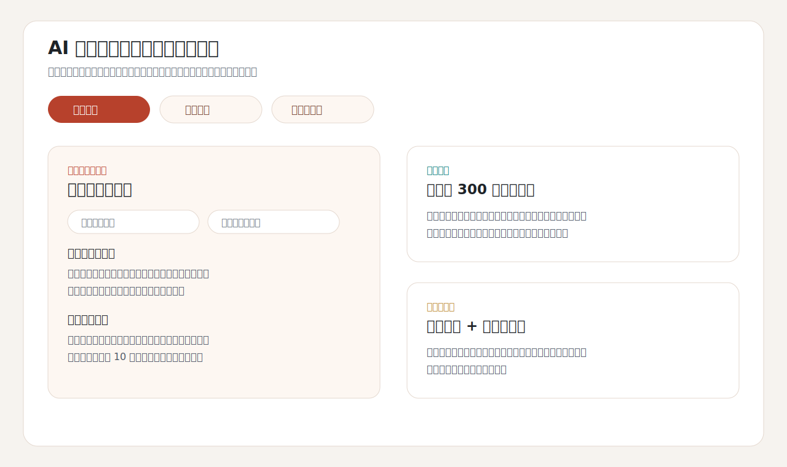

# AI 个性化小说推荐与阅读助手系统

面向免费阅读和网文重度用户的 AI 阅读助手原型，围绕“选书试错成本高、简介与正文质量不一致、长篇追更容易忘剧情”等痛点，提供个性化推荐、无剧透试读报告和剧情级前情回顾。



## 核心能力

- 书架画像：导入用户授权后的番茄网页书架脱敏数据，仅保留书名、阅读状态、类型标签等字段，不提交 Cookie、token 和原始响应。
- 偏好建模：将深度阅读、收藏、追更等行为作为高热爱样本；网页低进度只作为待验证信号，避免把未同步进度误判为负反馈。
- 可解释推荐：基于题材、爽点、设定关键词、相似风格和近期偏好生成候选排序，并输出“为什么适合你 / 可能不适合 / 建议先读几章验证”。
- 无剧透试读：针对本地 TXT 的前 3 章生成试读判断，关注开篇钩子、主角行动力、设定兑现和继续阅读建议。
- 前情回顾：针对长篇小说按章节分块、阶段摘要、全局合并，生成主角状态、剧情进展和接下来如何接着读。
- LLM 接入：支持 MiniMax M2.7 API，也保留本地规则版结果，便于无 Key 场景下演示。

## 技术栈

Python / JavaScript / LLM API / 推荐系统 / 用户画像 / HTTP Server

## 目录结构

```text
.
├── app/
│   ├── server.py                 # HTTP API 服务
│   ├── recommender.py             # Demo 推荐链路
│   ├── fanqie_recommender.py      # 番茄书架画像与推荐
│   ├── public_recall.py           # 公开候选池召回
│   ├── txt_story_analyzer.py      # 本地 TXT 章节解析与规则分析
│   ├── minimax_story_llm.py       # MiniMax 深度分析
│   └── llm_settings.py            # 安全环境变量配置
├── static/                        # 前端页面
├── scripts/                       # 辅助脚本
└── run.py                         # 启动入口
```

## 快速开始

```bash
python run.py
```

打开：

```text
http://127.0.0.1:8000/
```

如需启用 MiniMax：

```powershell
$env:MINIMAX_API_KEY="your_api_key"
python run.py
```

## 数据边界

公开仓库不包含真实番茄书架画像、小说正文、LLM cache 和 API Key。`app/txt_library/` 只保留占位文件，用户需要放入自己有权阅读的 TXT 文件后再运行试读和前情回顾功能。
